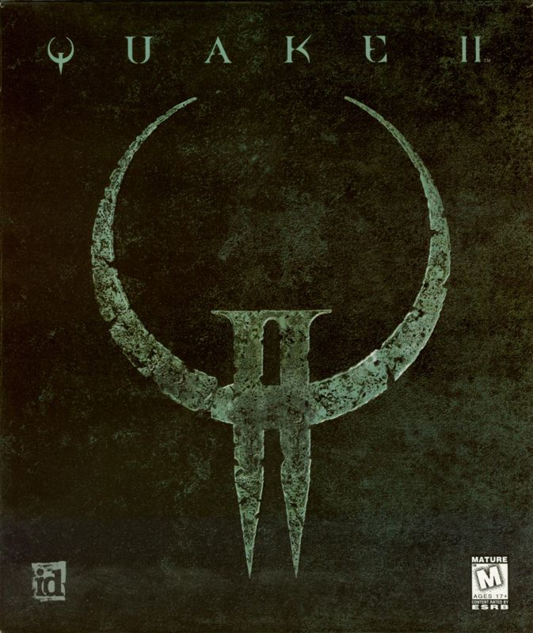
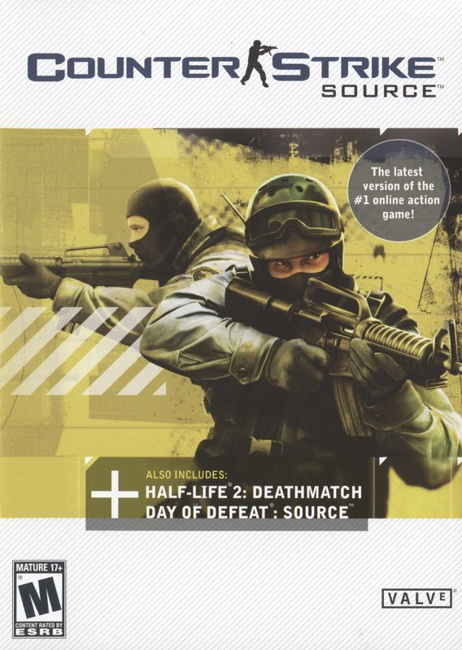
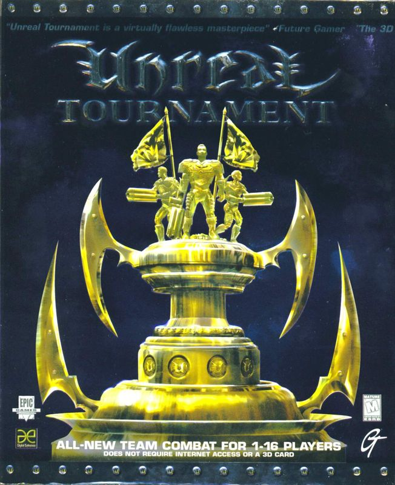

# Base

This repsitory holds a collection of written works by software developers, reverse engineers and programming enthusiasts alike!
Within each folder of this repository there is a a README document which should explain the contents in more detail. You may also [find a list of associated bulletin boards here](https://devious100.com/forum/base). From source development kits to base hooks and boilerplate code, the content of this repository is hyper-linked below for your convenience;

| Engines | Games |
|---------|-------|
| [Gold Source](https://github.com/devious100/base/tree/master/engines/gold-source) | &nbsp; [Counter-Strike 1.6](https://github.com/devious100/base/tree/master/engines/gold-source/counter-strike) |
| [Id Tech 2](https://github.com/devious100/base/tree/master/engines/id-tech-2) | &nbsp; [Quake 2](https://github.com/devious100/base/tree/master/engines/id-tech-2/quake-2) |
| [Id Tech 3](https://github.com/devious100/base/tree/master/engines/id-tech-3) | &nbsp; [Call of Duty 2](https://github.com/devious100/base/tree/master/engines/id-tech-3/call-of-duty-2) |
| [LithTech](https://github.com/devious100/base/tree/master/engines/lithtech) | &nbsp; [F.E.A.R](https://github.com/devious100/base/tree/master/engines/lithtech/f-e-a-r) |
| [Refractor 2](https://github.com/devious100/base/tree/master/engines/refractor-2) | &nbsp; [Battlefield 2](https://github.com/devious100/base/tree/master/engines/refractor-2/battlefield-2) |
|  | &nbsp; [Battlefield 2142](https://github.com/devious100/base/tree/master/engines/refractor-2/battlefield-2142) |
| [Source](https://github.com/devious100/base/tree/master/engines/source) | &nbsp; [Counter-Strike: Source](https://github.com/devious100/base/tree/master/engines/source/counter-strike-source) |
| [Unreal 2](https://github.com/devious100/base/tree/master/engines/unreal-2) | &nbsp; [Unreal Tournament](https://github.com/devious100/base/tree/master/engines/unreal-2/unreal-tournament) |

# Credit

All credit goes to the respective authors, named within the source material of this base. Should you be using any of this information for personal gains please give credit where it is due. Whilst this project is open-source, all digital rights holders within this base reserve the right on their respective properties.

# Contribute
You can leave comments, ask questions and find more information within [our online community forum](https://devious100.com). We actively encourage your contribution!

 
