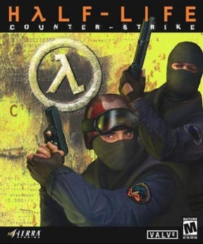

# Valve Corporation - Gold Source

GoldSrc, sometimes called the Half-Life Engine, is a proprietary game engine developed by Valve. At its core, GoldSrc is a heavily modified version of id Software's Quake engine.

# Games Resource

| Cover | Title  | Source | Discuss |
| ----- | ------ | ------ | ------- |
|  | Counter-Strike: 1.6 | [View Code](https://github.com/devious100/base/tree/master/engines/gold-source/counter-strike) | [Visit Board](https://devious100.com/forum/base/engines/gold-source/counter-strike) |

You can leave comments, ask questions and find more information within [the associated board](https://devious100.com/forum/base/engines/gold-source) on [our online community](https://devious100.com) forum. We actively encourage your contribution!
