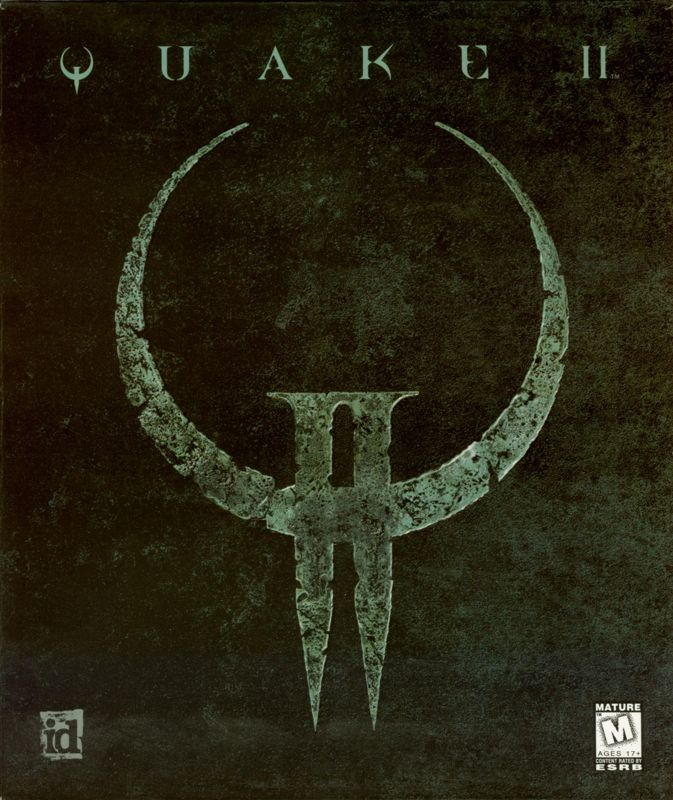

# Id Software - Tech 2 Engine

Formerly the "QUAKE 2 Engine", with pioneering innovation in 3D environments, a few of id Tech 2's most notable features were out-of-the-box support for OpenGL hardware-accelerated graphics (in addition to the traditional software renderer), and colored lighting effects. Games created on this engine technology include QUAKE II, Hexen II, Heretic II, Sin, Soldier Of Fortune, Half-Life, Kingpin and Anachronox.

# Games Resource

| Cover | Title  | Source | Discuss |
| ----- | ------ | ------ | ------- |
|  | Quake 2 | [View Code](https://github.com/devious100/base/tree/master/engines/id-tech-2/quake-2) | [Visit Board](https://devious100.com/forum/base/engines/id-tech-2/quake-2) |

You can leave comments, ask questions and find more information within [the associated board](https://devious100.com/forum/base/engines/id-tech-2) on [our online community](https://devious100.com) forum. We actively encourage your contribution!
