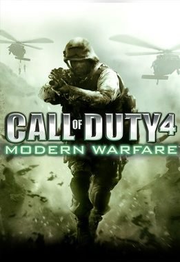
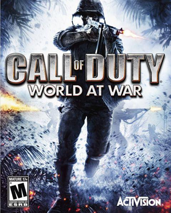
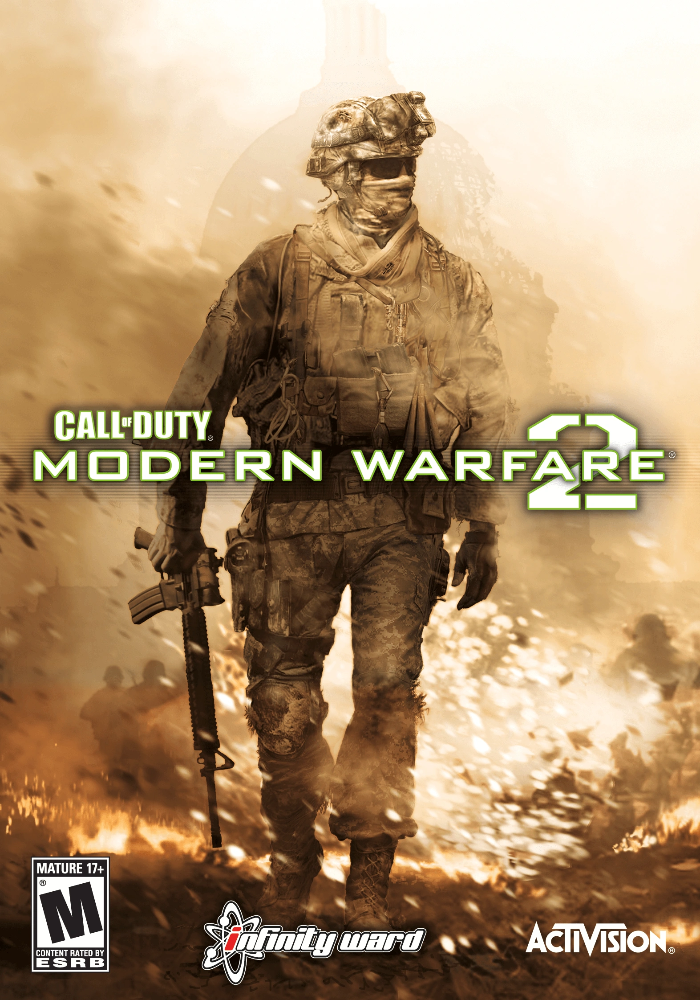
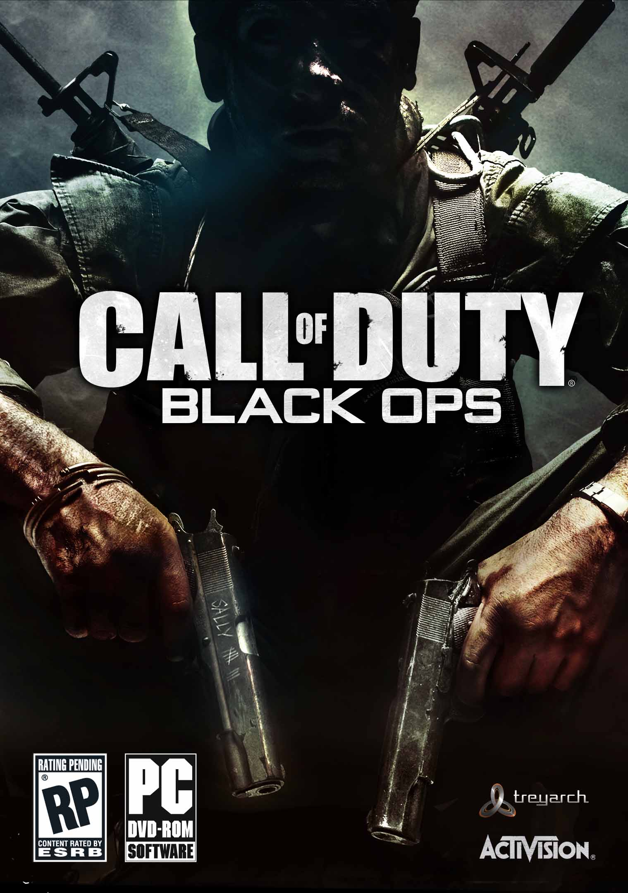

# Infinity Ward - IW Engine

The IW engine is a game engine created and developed by Infinity Ward for the Call of Duty series. The engine was originally based on id Tech 3.

# Games Resource

| Cover | Title  | Source | Discuss |
| ----- | ------ | ------ | ------- |
|  | Call of Duty: Modern Warfare | [View Code](https://github.com/devious100/base/tree/master/engines/infinity-ward/call-of-duty-4) | [Visit Board](https://devious100.com/forum/base/engines/infinity-ward/call-of-duty-4) |
|  | Call of Duty: World at War | [View Code](https://github.com/devious100/base/tree/master/engines/infinity-ward/call-of-duty-5) | [Visit Board](https://devious100.com/forum/base/engines/infinity-ward/call-of-duty-5) |
|  | Call of Duty: Modern Warfare 2 | [View Code](https://github.com/devious100/base/tree/master/engines/infinity-ward/call-of-duty-6) | [Visit Board](https://devious100.com/forum/base/engines/infinity-ward/call-of-duty-6) |
|  | Call of Duty: Black Ops | [View Code](https://github.com/devious100/base/tree/master/engines/infinity-ward/call-of-duty-7) | [Visit Board](https://devious100.com/forum/base/engines/infinity-ward/call-of-duty-7) |

You can leave comments, ask questions and find more information within [the associated board](https://devious100.com/forum/base/engines/i-w) on [our online community](https://devious100.com) forum. We actively encourage your contribution!
