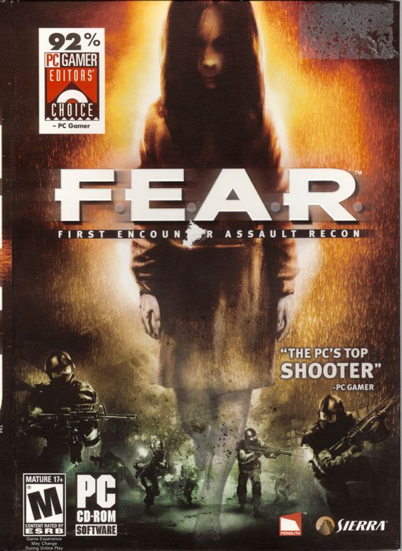

# Monolith Productions - LithTech Engine

The LithTech Engine was initially developed by Monolith in collaboration with Microsoft, until LithTeh Inc was formed to continue development on the engine. LithTech has been used to create a number of games, establishing itself as a viable alternative to other engines for FPS creation. The current iteration is codenamed 'Jupiter Extended' or 'Jupiter Ex'

# Games Resource

| Cover | Title  | Source | Discuss |
| ----- | ------ | ------ | ------- |
|  | F.E.A.R | [View Code](https://github.com/devious100/base/engines/lithtech/f-e-a-r) | [Visit Board](https://devious100.com/forum/base/engines/lithtech/f-e-a-r) |

You can leave comments, ask questions and find more information within [the associated board](https://devious100.com/forum/base/engines/lithtech) on [our online community](https://devious100.com) forum. We actively encourage your contribution!
