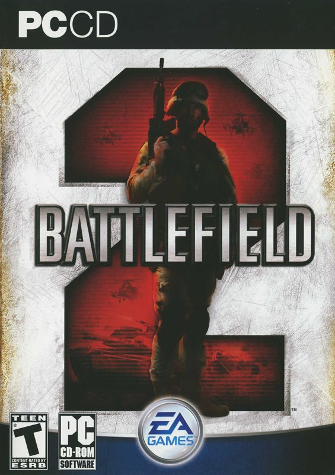
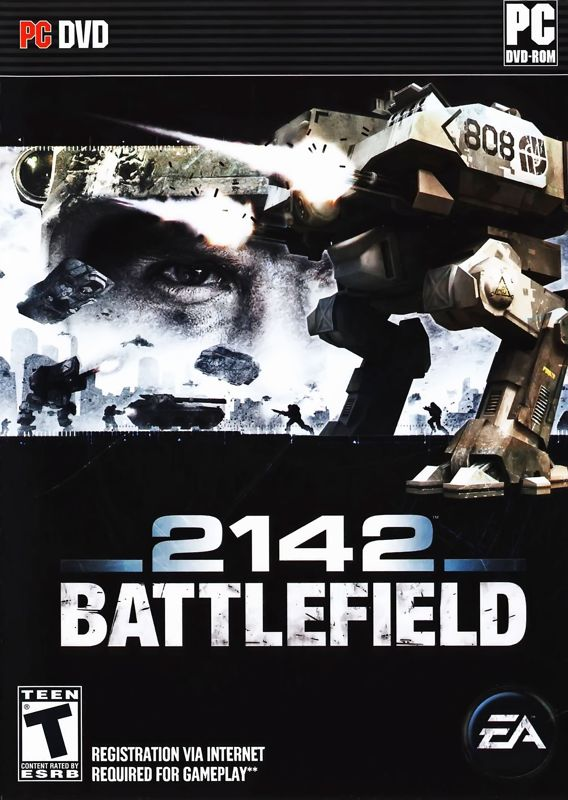

# DICE - Refractor 2 Engine

The Refractor Engine, is a game engine designed by Stockholm-based studio Refraction Games, first developed for the computer game Codename Eagle, which was released in November 1999. Since then, Refraction Games was bought by Digital Illusions CE, and working alongside with the Refraction Games team, designed and developed the Refractor 2 Engine for the famous Battlefield game series for the computer.

# Games Resource

| Cover | Title  | Source | Discuss |
| ----- | ------ | ------ | ------- |
|  | Battlefield 2 | [View Code](https://github.com/devious100/base/engines/refractor-2/battlefield-2) | [Read Thread](https://devious100.com/forum/base/engines/refractor-2/battlefield-2) |
|  | Battlefield 2142 | [View Code](https://github.com/devious100/base/engines/refractor-2/battlefield-2142) | [Read Thread](https://devious100.com/forum/base/engines/refractor-2/battlefield-2142) |

You can leave comments, ask questions and find more information within [the associated board](https://devious100.com/forum/base/engines/refractor-2) on [our online community](https://devious100.com) forum. We actively encourage your contribution!
