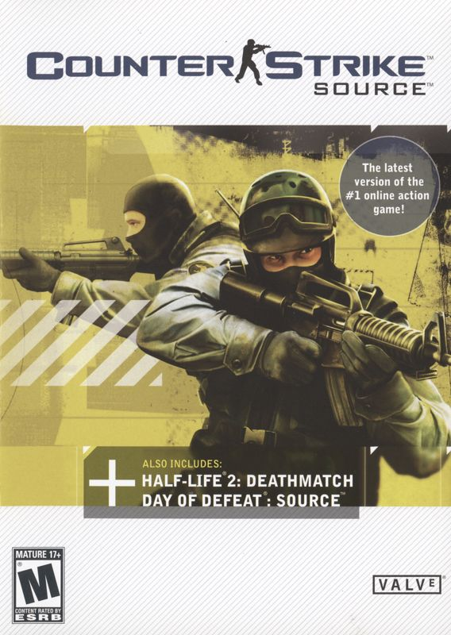

# Valve Corporation - Source Engine

The Source engine is a 3D game engine developed by Valve Corporation. Its unique features include a large degree of modularity and flexibility, an artist-driven, shader-based renderer, accurate lip sync and facial expression technology, and a powerful, efficient and completely network-enabled physics system.

# Games Resource

| Cover | Title  | Source | Discuss |
| ----- | ------ | ------ | ------- |
|  | Counter-Strike: Source | [View Code](https://github.com/devious100/base/engines/source/counter-strike-source) | [Visit Board](https://devious100.com/forum/base/engines/source/counter-strike-source) |

You can leave comments, ask questions and find more information within [the associated board](https://devious100.com/forum/base/engines/source) on [our online community](https://devious100.com) forum. We actively encourage your contribution!
