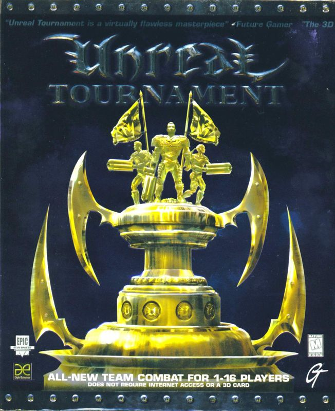

# Epic Games - Unreal Engine 2

Unreal Engine 2 is a complete game development framework targeted at today's mainstream PC's, Microsoft's Xbox game console, and Sony's PlayStation 2.

# Games Resource

| Cover | Title  | Source | Discuss |
| ----- | ------ | ------ | ------- |
|  | Unreal Tournament | [View Code](https://github.com/devious100/base/engines/unreal-2/unreal-tournament) | [Visit Board](https://devious100.com/forum/base/engines/unreal-2/unreal-tournament) |

You can leave comments, ask questions and find more information within [the associated board](https://devious100.com/forum/base/engines/unreal-2) on [our online community](https://devious100.com) forum. We actively encourage your contribution!
